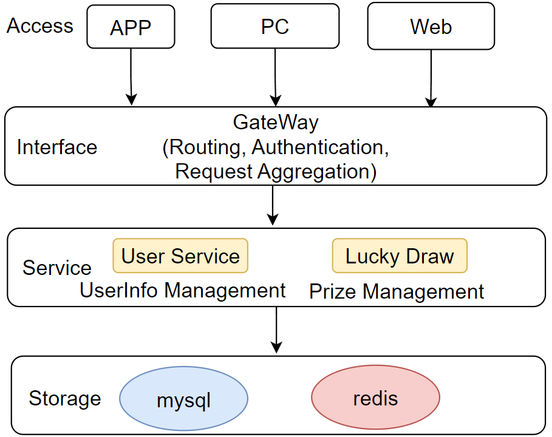

# ODSD
The OPPO Store Lucky Draw Platform is an integrated feature within the OPPO online store, offering daily users an exciting opportunity to participate in online lucky draw events. This platform enhances user engagement and rewards customer loyalty through regular prize-winning chances.

## Personal Responsibilities

**System Architecture and Design**

- Spearheaded the comprehensive requirements analysis, technology selection, and architectural design of the lucky draw system.
- Implemented a microservices architecture, dividing the system into key modules: gateway, usersvr, and lotterysvr.

**Data Storage Optimization**

- Designed and implemented a two-tier storage structure using MySQL and Redis.
- This approach effectively addressed high-precision data requirements and managed high-load scenarios, ensuring smooth operation of the lucky draw logic and result storage.

**Implementation and Development**

- Utilized the Kratos microservices framework to build the lucky draw service.
- Developed a well-structured codebase with clear module responsibilities and distinct architectural layers.

## Technical Challenges and Solutions:

**Probability Management and Fairness**

- Implemented a sophisticated system for setting prize probability intervals.
- Utilized random number matching to ensure varied winning probabilities for different prizes while maintaining fairness across users.

**Performance Optimization**

- Leveraged various Redis data structures to optimize prize management, blacklist handling, and draw attempt tracking.
- Enhanced performance of eligibility verification and prize matching/distribution logic.
- Improved system throughput from 1,000 QPS to 4,000 QPS.

**Even Distribution of Prizes**

- Designed and implemented a Redis-based prize pool system.
- Integrated with prize distribution plans and automated pool replenishment tasks.
- Ensured uniform distribution of winning probabilities throughout the entire campaign period.
- Further optimized performance to achieve 7,000 QPS.

**Concurrency and Idempotency**

- Implemented a Redis-based distributed locking mechanism.
- Ensured idempotency of the lucky draw API, preventing multiple simultaneous draw attempts by the same user.

This project showcases advanced system design, high-performance optimization, and robust implementation of a complex, high-concurrency platform, demonstrating strong skills in microservices architecture, data management, and scalable system development.

## Overall Architecture

The backend architecture is structured in a top-down approach, comprising four distinct layers:

1. Access Layer
2. Interface Layer
3. Service Layer
4. Storage Layer

The Storage Layer primarily utilizes MySQL for relational data storage and Redis for high-performance caching and in-memory data structures. This combination offers a robust and scalable foundation for data management.

The architectural diagram illustrating this layered structure is as follows:

 